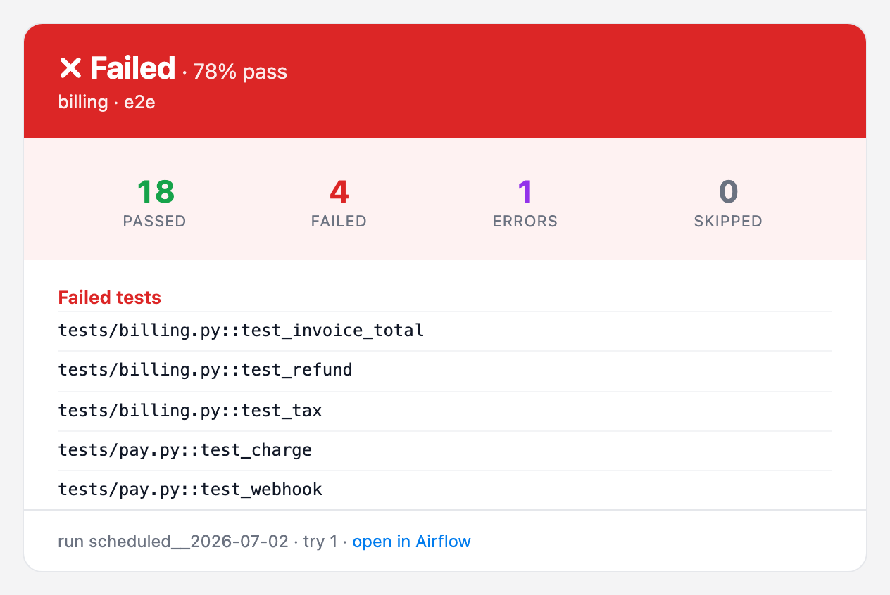
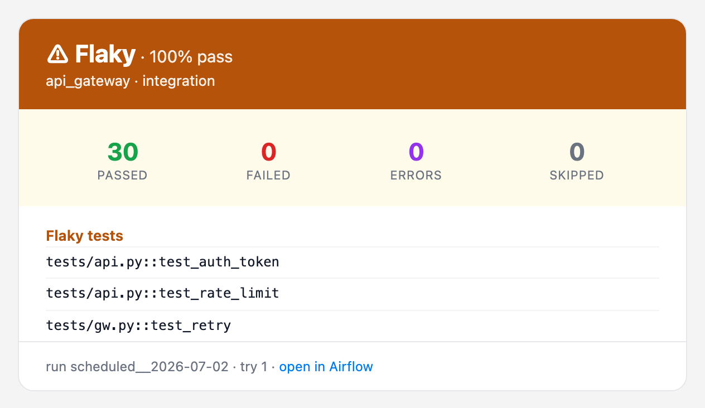
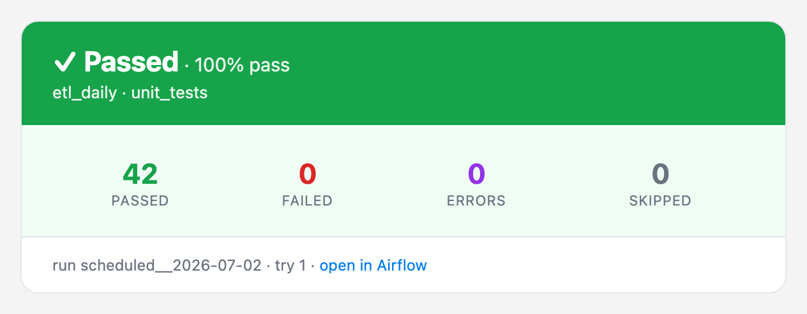

# airflow-pytest-plugin

View [`airflow-pytest-operator`](https://github.com/IKrysanov/airflow-pytest-operator)
results in the **Airflow 3** web UI.

**Package**

| Badge | What it tells you |
|:------|:------------------|
| [](https://pypi.org/project/airflow-pytest-plugin/) | Latest release on PyPI — `pip install airflow-pytest-plugin` |
| [](https://pypi.org/project/airflow-pytest-plugin/) | Supported Python versions (3.10+) |
| [](https://airflow.apache.org/) | Targets Airflow 3.x (FastAPI plugin UI) |
| [](https://opensource.org/licenses/Apache-2.0) | Distributed under the Apache-2.0 licence |

**Quality &amp; build**

| Badge | What it tells you |
|:------|:------------------|
| [](https://github.com/IKrysanov/airflow-pytest-plugin/actions/workflows/ci.yml) | Build & test suite (lint, types, unit, integration) on `main` |
| [](https://codecov.io/gh/IKrysanov/airflow-pytest-plugin) | Test coverage of the package |
| [](https://mypy-lang.org/) | Fully type-checked with mypy `--strict` |
| [](https://github.com/astral-sh/ruff) | Linted & formatted with Ruff |
| [](https://scorecard.dev/viewer/?uri=github.com/IKrysanov/airflow-pytest-plugin) | OpenSSF supply-chain security score |


The operator runs a `pytest` suite as an Airflow task and parses its JUnit report. This
plugin archives each report — keyed by `dag_id / run_id / task_id / try` — and serves a web
UI to browse them: per-run pass/fail counts and durations, the per-test breakdown with
captured output, plus cross-run analytics — flaky detection, per-test history, run
comparison, a test×run heatmap and a catalogue of unique tests.

Two halves sharing one on-disk layout:

| Side | Where it runs | What it is |
| --- | --- | --- |
| **Producer** | the worker | `ArchivingResultParser`, a drop-in `parser=` for `PytestOperator` |
| **Reader** | the API server | a FastAPI app + single-page viewer, registered as an Airflow plugin |

## Contents

- [Screenshots](#screenshots)
- [Install](#install)
- [Quickstart](#quickstart)
- [Do I need `cleanup="never"`?](#do-i-need-cleanupnever)
- [How it works](#how-it-works)
- [HTTP API](#http-api)
- [Access control (RBAC)](#access-control-rbac)
- [Captured output](#captured-output)
- [Coverage](#coverage)
- [AI triage](#ai-triage)
- [Report assistant](#report-assistant) — [full docs](src/airflow_pytest_plugin/assistant/README.md)
- [Allure / TestOps export](#allure--testops-export)
- [Configuration](#configuration)
- [Prometheus metrics](#prometheus-metrics)
- [Retention (auto-cleanup)](#retention-auto-cleanup)
- [Email alerts](#email-alerts)
- [Architecture (SOLID)](#architecture-solid)
- [Development](#development)
- [License](#license)

## Screenshots

**Overview** — run list grouped by dag·task, historical chart with an optional pass-rate
trend line, flaky panel, and KPI cards. The ⚙ button switches main-board panels off; the
choice is remembered per browser.


**A single run** — success donut, coverage card, duration histogram, searchable case table,
and each test's own prints and log lines on expand (see [Captured output](#captured-output)).


**AI triage** — every failed test carries a category, hypothesis, suggested fix and a rerun
command; the card above the table filters by category. See [AI triage](#ai-triage).


**Flaky tests & comparison** — tests that both pass and fail in the window, with a score,
trend and quarantine badge; *Compare to previous* diffs a run against the prior one.


**Slowdowns** — tests whose recent average duration got worse, beside the slowest tests.


**Test×run heatmap** — tests (rows) × recent runs (columns). Flaky tests read as alternating
rows, a regression as a block, a broken build as a column.


**Unique tests & failures** — the catalogue of distinct tests, and what is broken *now*,
grouped into clusters by normalized error.


---

## Install

```bash
pip install airflow-pytest-plugin          # producer side (workers)
pip install 'airflow-pytest-plugin[web]'   # reader side (API server)
```

Airflow 3's API server already provides FastAPI, so the bare install is enough there too;
`[web]` only adds the standalone dev server.

Every Airflow 3 minor is covered by CI — the plugin is installed against **3.0, 3.1, 3.2 and
3.3** with Airflow's own constraints, and the embedded UI is driven under the oldest and the
newest of them.

| Extra | Side | What it adds |
|:--|:--|:--|
| `web` | reader | FastAPI + uvicorn, for the standalone dev server |
| `secure-xml` | reader | `defusedxml`, hardened parsing of untrusted JUnit reports |
| `triage` | **worker** | `pytest-triage` plus its offline `fake` provider ([AI triage](#ai-triage)) |
| `triage-anthropic` / `triage-openai` / `triage-gigachat` | **worker** | the same, with that provider's SDK |
| `assistant` | **API server** | dependency-free report chat with its bundled offline `fake` provider ([Report assistant](#report-assistant)) |
| `assistant-anthropic` / `assistant-openai` / `assistant-gigachat` | **API server** | report chat plus only that provider's direct SDK; no `pytest-triage` dependency |
| `assistant-local` | **API server** | `llama-cpp-python` for an optional in-process GGUF context reducer |

Triage extras belong on the **worker**, where the tests run. Assistant extras belong in the
**API-server** image, where questions are answered from the archived reports.

## Quickstart

**1. Point your operator at the archiving parser** — the only DAG change:

```python
from airflow_pytest_operator import PytestOperator
from airflow_pytest_plugin import ArchivingResultParser

PytestOperator(
    task_id="run_tests",
    test_path="tests/",
    parser=ArchivingResultParser(),   # was JUnitResultParser()
)
```

The task log then carries a tracking link straight to the archived run, provided
`[api] base_url` is set.

**2. Tell both sides where reports live:**

```bash
export AIRFLOW_PYTEST_REPORTS_ROOT=/opt/airflow/pytest-reports
```

or in `airflow.cfg`:

```ini
[pytest_reports]
reports_root = /opt/airflow/pytest-reports
```

In a distributed deployment this must be a **shared volume** both the workers (writing) and
the API server (reading) can see.

**3. Open the UI.** The plugin registers itself via the `airflow.plugins` entry point — no
config. It mounts at `/pytest-reports`, with a **Pytest Reports** entry under *Browse*.

### Preview locally, without Airflow

```bash
python -m airflow_pytest_plugin.web --root ./pytest-reports --port 8000
# open http://127.0.0.1:8000/
```

---

## Do I need `cleanup="never"`?

**No.** In the operator the *parser* owns the report location, and a parser-supplied
directory is never deleted by the runner under any cleanup policy. `cleanup="never"` only
matters when the runner uses throwaway temp dirs — the fragile path this plugin replaces.

## How it works

```
worker                              shared volume                 API server
──────                              ─────────────                 ──────────
PytestOperator                      {root}/{dag}/{run}/           FastAPI app
  └─ ArchivingResultParser ──▶   {task}/t{try}/        ◀──── FileSystemReportSource
       report_request() → path          ├─ junit.xml              └─ lists meta.json,
       parse()          → meta.json     └─ meta.json                 parses junit.xml
```

`report_request()` reads the live Airflow context, computes the archive directory and hands
it to the operator's JUnit parser. `parse()` reuses that parsing and drops a `meta.json`
sidecar with the Airflow coordinates and the summary, which makes each report
**self-describing** — the reader needs no database access. The reader lists by scanning
`meta.json` (fast) and parses `junit.xml` on demand for per-case detail.

Optional flags add files beside those two, each read by one consumer: `allure-results/`,
`coverage.json` (folded into `meta.json` at archive time) and `verdicts.json` (AI triage).

The directory is a human-friendly container; identity lives in `meta.json` and in the API's
opaque report token, so awkward `run_id` characters are sanitised in the path losslessly.

## HTTP API

The app is mountable under any prefix; the viewer derives its API base at
runtime. Endpoints (relative to the mount):

| Method & path | Returns |
| --- | --- |
| `GET /` | the single-page viewer (HTML) |
| `GET /api/reports?dag_id=&run_id=` | summaries, newest first (each with its AI `triage` mix, when analysed) |
| `GET /api/reports/{report_id}` | one report with per-case rows (each with its AI `verdict`, when the run was triaged) plus the run's `triage` roll-up |
| `GET /api/groups?dag_id=&task_id=` | runs aggregated by dag·task (count, pass-rate, avg duration, last status) |
| `GET /api/failures?dag_id=&run_id=&task_id=&latest=` | failed/errored cases — each dag·task's latest run by default (`latest=0` for full history) |
| `GET /api/failure-clusters?dag_id=&run_id=&task_id=&latest=` | failures grouped by normalized error signature (biggest first); latest-run-only by default |
| `GET /api/compare?base=&head=` | per-test diff between two runs (newly failed / fixed / …) |
| `GET /api/flaky?dag_id=&task_id=&window=` | flaky tests with score, trend, and a quarantine flag |
| `GET /api/slow?dag_id=&task_id=&window=` | duration regressions (tests whose execution time got slower) + the slowest tests by average |
| `GET /api/heatmap?dag_id=&task_id=&window=` | test×run outcome matrix for one dag·task (rows = tests sorted most-broken first, cells = `p`/`f`/`e`/`s`/`-` aligned to recent runs; `cats` marks which cells the AI judged and how) |
| `GET /api/test-history?dag_id=&task_id=&node_id=&limit=` | one test's outcome per run |
| `GET /api/unique-tests?dag_id=&task_id=&run_id=&full=` | distinct test count (+ when `full`, each test's runs / passed / failed / errors / skipped / avg duration) |
| `DELETE /api/reports/{report_id}` | delete a report (RBAC-gated) |
| `POST /api/reports/delete` | delete up to 200 reports in one request (RBAC-gated per DAG; partial success is reported per id) |
| `GET /api/reports/{report_id}/allure.zip` | raw Allure results as a zip (if any) |
| `GET /api/assistant/status` | whether report chat is configured; does not load either model |
| `POST /api/assistant/query` | answer from an RBAC-filtered, bounded report snapshot |
| `POST /api/assistant/stream` | the same answer as Server-Sent Events, token by token |
| `GET`/`DELETE`/`PATCH /api/assistant/history` | the caller's stored chats: read, clear, rename (their own only) |
| `POST /api/assistant/health` | one fixed probe proving the configured models answer (opt-in; billable) |
| `GET /api/health` | liveness + readiness: `status`, `ready`, `reports_root`(+`_exists`), `auth`, `secure_xml` |
| `GET /api/version` | `{"name": ..., "version": ...}` from package metadata |
| `GET /api/metrics` | Prometheus exposition — opt-in, bearer-token (see [Prometheus metrics](#prometheus-metrics)) |
| `GET /api/docs` | OpenAPI docs (Swagger UI) |

The reads (`GET`) and the delete are gated by Airflow RBAC — see below.

## Access control (RBAC)

Every check goes through Airflow's **auth manager** (`is_authorized_dag(...)`) — the same
call Airflow's own DAG-run endpoints make — keyed by the report's `dag_id` and the user:

| Action | Airflow 3.x check | Airflow 2.x (FAB) |
| --- | --- | --- |
| **See / open a report** | `is_authorized_dag(method="GET", access_entity=RUN)` | `can_read` on the DAG |
| **Delete a report** | `is_authorized_dag(method="POST", access_entity=RUN)` | trigger / `can_create` |

The list is filtered to the DAGs you may read; opening one you cannot read returns `403`;
deleting requires permission to **trigger** its DAG. Bulk delete
(`POST /api/reports/delete`) applies the same per-DAG check — no batch-wide permission, no
administrator bypass — evaluated once per DAG rather than once per run; a mixed selection
deletes only what you may trigger and returns the rest as `forbidden`. Its body is capped at
1 MiB, 200 ids, 4096 characters each (`413` / `422` past those), and at most four batches run
at once — beyond that it answers `503` **without deleting anything**, so the batch is safe to
retry.

Every check **fails closed**. `GET /api/health` reports which mode is live:

| `auth` | Meaning |
| --- | --- |
| `airflow` | Airflow's RBAC is consulted per request (the normal deployment) |
| `open` | No Airflow — the standalone dev server, everything is served |
| `denied` | Airflow present but its auth unreachable: every report is refused |

**The plugin nav entry is visible to every signed-in user** — Airflow has no per-permission
gate for plugin links — but a user who may read no DAG sees an empty list and `403` on
direct links.

**Two endpoints sit outside per-DAG RBAC.** `GET /api/metrics` is gated by
`AIRFLOW_PYTEST_METRICS_TOKEN` instead, and exposes series for **every** dag·task — treat
that token as a read-everything credential. `GET /api/health` and `/api/version` need no
auth; health reports the configured `reports_root` path.

Report tokens encode a run's coordinates and nothing else — identifiers, never capabilities.
Every token-addressed route re-checks permission before serving.

## Allure / TestOps export

Opt in per task and install [`allure-pytest`](https://pypi.org/project/allure-pytest/)
on the worker:

```python
parser=ArchivingResultParser(allure=True)
```

The parser then adds `--alluredir` (pytest errors with *unrecognized arguments*
if `allure-pytest` is missing), so the **raw Allure results** are archived next to
the report, with an `executor.json` linking the launch back to the Airflow run.
Download them from a report's detail view, or `GET
/api/reports/{id}/allure.zip` — then upload to [Allure TestOps](https://qameta.io/)
(`allurectl upload …`). The JUnit viewer is unaffected; both artifacts coexist.

## Captured output

Every test's own `print()` and `logging` output is archived with the run and shown under its
traceback, in its own scrolling block — for passing tests too, where it is the only content
there is.

This needs pytest's `junit_logging`, which defaults to **`no`**: without it the archive keeps
tracebacks and drops everything the test printed. The parser sets it itself, so the archive
does not depend on the operator version or the project's `pytest.ini`:

```python
ArchivingResultParser(logs=True)              # default
ArchivingResultParser(logs=False)             # tracebacks only
ArchivingResultParser(logs_only_fail=True)    # capture, but only for failed/errored tests
```

`logs_only_fail=True` is enforced on the archive, not asked of pytest. pytest's own
`junit_log_passing_tests` is the wrong lever twice over: a **skipped** test still writes its
capture (500 skips at 32 KB each left a 6 MB report), and an **errored** one loses it — a
fixture that logged why it could not set the test up would archive nothing. The archive is
narrowed after the run instead, so failures and errors keep their output and nothing else
does.

A DAG that sets `-o junit_logging=...` in its own `pytest_args` still wins — pytest honours
the last override, and the task's arguments are spliced after the parser's. `-s` /
`--capture=no` turns capture off entirely, so nothing reaches the report.

**Size.** On 500 tests × 2 KB of output, `junit.xml` grows 0.04 MB → 1.19 MB (× 32 KB:
15.8 MB). `logs_only_fail=True` brings the first case back to 0.06 MB. Past 32 MB a report is
trimmed to its failures automatically, whatever the setting, and the task log says so.

The API response is bounded independently: 16 KB per test, then 2 MB of captured output and
4 MB of failure text per run — past either, a case says its text was omitted rather than
looking silent. The caps count **UTF-8 bytes**, so non-ASCII output gets the same budget as
ASCII rather than 2–4× it. A pathological run (2,000 failures × 16 KB traceback + 16 KB
output) answers in 6.2 MB instead of 66 MB.

Parsing itself is bounded too, because building the tree costs up to 5× the file (45 MiB of
XML peaked at 220 MiB and 5.2 s of CPU) **inside the api-server**. A report past
`AIRFLOW_PYTEST_MAX_REPORT_MIB` (default 64) is not parsed: the run stays in the list with
its real numbers, opening it answers `413` with the reason, and the other views keep working
from `meta.json`. For scale, a 2,000-test run where *every* test failed with 32 KB of logs
each is 62 MiB — and a passing run cannot get there at all, since the producer trims capture
from non-failing cases above 32 MB. `meta.json` has the same arrangement
(`AIRFLOW_PYTEST_MAX_META_MIB`, default 16 ≈ a quarter-million tests): past it the per-test
rows are left unparsed and come from `junit.xml` instead. Set either to `0` to remove the
limit.

**Secrets.** Captured output is stored verbatim, outside Airflow's task-log masking. If tests
print tokens or personal data, that text is readable by anyone who can read the DAG's
reports — use `logs=False` or `logs_only_fail=True`, and align the reports' retention with
your log-retention policy.

## Coverage

The run detail shows a **Coverage** card next to Duration. Needs `pytest-cov` on the worker.

```python
result_parser=ArchivingResultParser(coverage=True)
```

The parser adds `--cov` plus a JSON report into the archive, reads the fraction while
archiving and bakes it into `meta.json`. This is the route to prefer: it **survives a failed
run** (the operator raises after the parser, so a red suite still gets its coverage), needs
no metadata-DB query to render the card, and coexists with the operator's own
`coverage=True` — a duplicate `--cov` measures the same thing once.

**Scope.** A bare `--cov` measures everything, and pytest-cov *unions* scopes — so if the
project already narrows coverage (`addopts = "--cov=src"`), pass the same scope or the
number silently widens:

```python
ArchivingResultParser(coverage=True, coverage_source="src")
```

**Without the parser flag**, and with `coverage=True` on the operator, the viewer reads the
fraction from the operator's XCom on first view. That works only for runs that finished
successfully. Either way, a run with no coverage simply has no card.

**The bar** comes from the env default, or from the suite itself — the per-task value wins,
so a core library can sit at 95% while a legacy suite is fine at 50%:

```bash
export AIRFLOW_PYTEST_SUCCESS_COVERAGE=0.7            # global default (else 0.85)
```

```python
ArchivingResultParser(coverage=True, coverage_threshold=0.95)
```

A value outside 0–1 is rejected with a warning rather than clamped. The card reads *meets
target 70%* or *below target 70%* in words, not by colour alone.

> **Coverage never fails a run** — it only colours the card. To fail the task on a shortfall,
> use the operator's `cov_fail_under`.

## AI triage

A traceback says what broke. [`pytest-triage`](https://pypi.org/project/pytest-triage/)
answers the next question — *is this my code, the test, or the environment?* — and this
plugin archives that judgement with the run and shows it beside the failure.

Install on the **worker** with the provider you want, give its SDK a key, and name it:

```bash
pip install 'airflow-pytest-plugin[triage-anthropic]'   # or [triage-openai] / [triage-gigachat]
export ANTHROPIC_API_KEY=sk-ant-...                     # read by that SDK, never by us
```

```python
result_parser=ArchivingResultParser(triage_provider="anthropic")
```

Three levels of opt-in:

| What you want | What to pass | Cost |
|:--|:--|:--|
| Nothing (default) | — | none |
| Every failure's exception type and a command that reruns just it | `triage=True` | none: no provider, no network |
| A verdict, hypothesis and suggested fix per failure | `triage_provider="anthropic"` | see below |

`triage_provider="fake"` classifies off the exception type — a full rehearsal with no key
and no network.

### In the UI

Each failed test carries a **category** chip (`regression` / `flaky` / `env` / `test_bug` /
`unclear`) and expands to the model's hypothesis, suggested fix, confidence and a rerun
command, above the traceback. A card over the case table names the model, shows the category
mix and filters the table to one group. The heatmap names the AI's reading of a hovered
cell, and the run list marks each analysed run — **blue** judged, **red** the pass broke,
**grey** report-only.

### Configuration

| Parser argument | pytest-triage flag | Default | Purpose |
|:--|:--|:--|:--|
| `triage=True` | `--ai-report=<archive>/triage.json` | off | archive the failure report |
| `triage_provider="NAME"` | `--ai-triage=on --ai-provider=NAME` | off | also run the LLM pass; implies the report |
| `triage_budget=N` | `--ai-budget=N` | `10` | most provider calls per run — the cost ceiling |
| `triage_timeout=SEC` | `--ai-timeout=SEC` | `30` | wall clock per call |

`triage=False` is an off switch and **wins** over a configured provider: no report, no call,
and a line in the task log saying why. Only **failed and errored** tests are ever sent —
skipped, `xfail` and passing tests cost nothing.

Providers are pytest-triage's: `anthropic`, `openai` (and any OpenAI-compatible endpoint via
`OPENAI_BASE_URL`), `gigachat`, plus the offline `fake`. Keys and model choice are read by
each SDK from the environment; this plugin never sees or stores them.

### What a run costs

One real Anthropic run of a suite breaking nine ways (`claude-sonnet-5`, July 2026 prices):
**9 calls, 11,882 input + 2,090 output tokens, $0.067, ~40 s** — one call per failing test.
A retry re-analyses the same failures and pays again, so `retries=3` can cost 4× the budget;
each try keeps its own verdicts, which is what makes "did the retry fail differently?"
answerable. Verdicts are not deterministic.

### When the pass does not complete

A rejected key, a timeout, an exhausted budget or an unreachable provider are failures **of
the pass, not diagnoses of your tests**. pytest-triage reports them as `unknown` verdicts;
the plugin drops those and states the reason once, in the provider's own words:

> ⚠ The AI pass did not complete: triage provider error: AuthenticationError: Error code:
> 401 — API key is invalid.

so a misconfigured run reads as misconfigured, not as nine "unclear" tests. All four modes
were exercised against the real library with zero invented verdicts.

### What is stored

Beside `junit.xml`: `verdicts.json` (the distilled judgements) and a small roll-up in
`meta.json` (model, duration, category counts). pytest-triage's own `triage.json` is removed
once distilled, and kept only when it could not be read.

The split is load-tested: every tree scan parses each `meta.json`, so verdicts kept there
made a cold scan of 3,000 runs **4.4× slower** (300 ms → 1,325 ms) and grew the scanned
corpus from 48 MB to 1.3 GB. Beside it, the scan is unchanged and the cost lands on the one
request that shows them (+6 ms on a 500-test run). Like coverage, verdicts are read while
archiving, so they survive a failed run.

`GET /api/reports` carries the mix and `incomplete` flag per run; `GET /api/reports/{id}`
adds the per-test judgements.

> **Requires `pytest-triage` on the worker** — the flags are spliced onto the pytest command
> line, so pytest aborts on unrecognized arguments if it is missing. Nothing else about
> triage can fail a run: an unreadable report just leaves the archive without an AI section.

## Report assistant

An **AI assistant** button on the dashboard answers questions about the reports you are
looking at. Every request repeats Airflow's DAG read checks on the server, so an answer can
only be built from reports you may already open. Answers stream, cite the runs they used, and
show exactly what was sent and what it cost. Type `/` for commands (`/explain`, `/bug`,
`/flaky`, `/priority`, `/compare`, `/summary`, `/test`, `/docs`). It ships with a manual of this product, so it can
answer "how do I run my first test?" out of the box — point it at your own manuals to replace
that — and it will write pytest when you ask.


It is **off until you configure a provider** — with none set there is no button, no client
code in the page and no `/api/assistant/*` routes at all.

```bash
pip install 'airflow-pytest-plugin[assistant-anthropic]'
export AIRFLOW_PYTEST_ASSISTANT_PROVIDER=anthropic
export ANTHROPIC_API_KEY=sk-ant-...
```

> **[Full assistant documentation →](src/airflow_pytest_plugin/assistant/README.md)**
> Setup, the two context modes, per-user limits and cost, the database it can use for
> shared chats, and every environment variable it reads.

## Configuration

| Setting | Default | Purpose |
| --- | --- | --- |
| `AIRFLOW_PYTEST_REPORTS_ROOT` (env) | — | report root (highest precedence) |
| `[pytest_reports] reports_root` (cfg) | — | report root |
| built-in default | `/opt/airflow/pytest-reports` | fallback |
| `AIRFLOW_PYTEST_PLUGIN_ENABLE` (env) | `True` | reader on/off — see below |
| `AIRFLOW_PYTEST_SCAN_CACHE_TTL` (env) | `2.0` | seconds a directory scan is reused (`0` disables) |
| `AIRFLOW_PYTEST_RETENTION_MAX_AGE_DAYS` (env/cfg) | — | delete runs older than N days |
| `AIRFLOW_PYTEST_RETENTION_MAX_RUNS` (env/cfg) | — | keep at most N newest runs per dag·task |
| `AIRFLOW_PYTEST_RETENTION_MAX_TOTAL_MB` (env/cfg) | — | total report-tree budget in MB |
| `AIRFLOW_PYTEST_FLAKY_WINDOW` (env/cfg) | `30` | default recent runs the flaky detector scans |
| `AIRFLOW_PYTEST_FLAKY_QUARANTINE_SCORE` (env/cfg) | `0.5` | flakiness score (0–1) that flags a test for quarantine |
| `AIRFLOW_PYTEST_FLAKY_MIN_SCORE` (env/cfg) | `0.1` | flakiness score (0–1) below which a test is not counted as flaky |
| `AIRFLOW_PYTEST_SLOW_FACTOR` (env/cfg) | `1.3` | how much slower (recent-half avg ÷ older half, ≥1) a test must get to count as a duration regression |
| `AIRFLOW_PYTEST_SLOW_MIN_DELTA` (env/cfg) | `0.5` | minimum absolute slowdown in seconds for a regression to register (filters jittery fast tests) |
| `AIRFLOW_PYTEST_SUCCESS_THRESHOLD` (env/cfg) | `0.85` | pass-rate (0–1) over executed tests at/above which a run counts as successful (*Passing runs*); `1.0` = strict, zero failures/errors |
| `AIRFLOW_PYTEST_SUCCESS_COVERAGE` (env/cfg) | `0.85` | line-coverage fraction (0–1) at/above which a run's **coverage** card reads as passing; below it the card turns red. Presentational only — it never fails a run (see [Coverage](#coverage)) |
| `AIRFLOW_PYTEST_ASSISTANT_DB_CONN_ID` / `_DB_URL` (env) | Airflow's metadata DB | where the assistant's own tables live — shared token quota and server-side chat history (see the [assistant docs](src/airflow_pytest_plugin/assistant/README.md#database)) |
| `AIRFLOW_PYTEST_METRICS_TOKEN` (env/cfg) | — | bearer token that **enables** the Prometheus `/api/metrics` endpoint; unset = disabled (see [below](#prometheus-metrics)) |
| `AIRFLOW_PYTEST_ALERTS_EMAIL_TO` (env/cfg) | — | comma-separated alert recipients (empty = alerting stays off; a per-task `email=True` *or* `email_only_fail=True` flag is the on-switch — see [below](#email-alerts)). Validated, case-insensitively deduped, capped at 50 (use a mailing-list address for bigger audiences) |
| `AIRFLOW_PYTEST_MAX_REPORT_MIB` (env/cfg) | `64` | largest `junit.xml` the **viewer** will parse. Past it the run stays listed but opening it answers `413`; `0` = no limit. Parsing costs up to 5× the file inside the api-server, so this is a guard rail, not a quota — raise it if you really archive more |
| `AIRFLOW_PYTEST_MAX_META_MIB` (env/cfg) | `16` | largest `meta.json` a tree scan will decode whole (~a quarter-million tests). Past it the per-test rows are skipped and come from `junit.xml`; the run stays listed, counted by retention and openable. `0` = no limit |
| `AIRFLOW_PYTEST_ALERTS_EMAIL_DOMAINS` (env/cfg) | — | comma-separated domains the plugin may email (`corp.io` also covers `ci.corp.io`). Unset = anywhere; set but naming no usable domain = **nothing** may be emailed (a typo must not quietly mean "anywhere"), logged as an error. Set it if the ✉ button should stay internal: recipients come from the request body, so read access to a DAG otherwise reaches any address — an address outside the list is refused with `400`, and a configured one is dropped with a warning |
| `AIRFLOW_PYTEST_SMTP_*` (env/cfg) | — | standalone SMTP (`_HOST`, `_PORT`, `_USER`, `_PASSWORD`, `_FROM`, `_STARTTLS`); when `_HOST` is set it is used directly (takes precedence over Airflow's `send_email`), otherwise it's the fallback |

**Enable / disable the reader.** A falsey `AIRFLOW_PYTEST_PLUGIN_ENABLE` (`0`, `false`,
`no`, `off`) stops the plugin registering its UI and API. It is a kill switch for the reader
only — `ArchivingResultParser` keeps archiving — and is read at plugin discovery, so it takes
effect on the next API-server restart.

**Scan cache.** The filesystem source reuses one directory scan for
`AIRFLOW_PYTEST_SCAN_CACHE_TTL` seconds instead of walking the tree per endpoint; deletes
invalidate it immediately. New runs therefore appear within a couple of seconds, or on
**Refresh**. Set `0` to disable, higher on a very large tree.

## Prometheus metrics

`GET /api/metrics` exposes per-dag·task gauges (from each dag·task's **latest** run)
in the Prometheus text format — `airflow_pytest_latest_{passed,failed,errors,skipped,
tests,pass_ratio,duration_seconds,success,run_timestamp_seconds}{dag_id,task_id}` and
`airflow_pytest_dagtask_runs{dag_id,task_id}`, plus globals
`airflow_pytest_{up,runs,dagtasks,latest_failures,series_truncated,build_info}` (all gauges).

When the report assistant is configured, the same scrape also carries what it costs:
`airflow_pytest_assistant_requests_total{mode,outcome}` (mode `direct`/`local`; outcome
`answered`, `empty_scope`, `busy`, `error`, `stopped`),
`airflow_pytest_assistant_provider_tokens_total{kind}` for `input`, `output` and
`cached_input`, `airflow_pytest_assistant_provider_seconds_total`,
`airflow_pytest_assistant_{local_reduce_calls,reports_considered,context_limited,output_limited}_total`,
and the `airflow_pytest_assistant_{enabled,in_flight}` gauges. They are per API-server
process, reset on restart, and carry no question, report or user — only cost and health.
Multiply the token counters by your provider's rates to get spend; `busy` and `stopped`
tell you whether one worker is enough.

It's **disabled by default** and turns on only when you set a scrape token; requests must
then present it as a bearer token (constant-time compared). The scrape is cheap and
bounded — one cached directory scan, summary-derived (no per-run reads), capped at 2000
series — so it's safe to poll frequently.

```bash
export AIRFLOW_PYTEST_METRICS_TOKEN="$(openssl rand -hex 16)"
```

```yaml
# prometheus.yml
scrape_configs:
  - job_name: airflow-pytest
    metrics_path: /pytest-reports/api/metrics   # the plugin's mount prefix
    authorization:
      credentials: "<AIRFLOW_PYTEST_METRICS_TOKEN>"
    static_configs:
      - targets: ["airflow-apiserver:8080"]
```

## Retention (auto-cleanup)

Reports accumulate until you prune them. Set any `AIRFLOW_PYTEST_RETENTION_*` limit (all
opt-in) and schedule `prune_reports` from a maintenance DAG:

```python
from airflow_pytest_plugin import prune_reports

with DAG("pytest_reports_retention", schedule="@daily", catchup=False, ...):
    PythonOperator(task_id="prune", python_callable=prune_reports)
```

Limits combine as a union — a run goes if **any** applies: older than `…_MAX_AGE_DAYS`,
beyond the newest `…_MAX_RUNS` of its dag·task, or oldest-first until the tree fits
`…_MAX_TOTAL_MB`. The **newest run of each dag·task is always kept**.

`prune_reports(dry_run=True)` reports what would go without deleting. The returned
`RetentionResult` carries `deleted`, `freed_bytes`, `scanned` and `failed` — runs the store
refused to remove are never counted as freed, and the size budget re-plans around them:
a run that cannot be deleted does not stop the sweep from freeing the space behind it.

Retention only sees directories that still have their `meta.json`. One left behind by a
crashed worker, or by a delete the storage refused half-way through, is invisible to the
sweep **and to the size budget** — it has to be removed by hand. The task log names the
path when that happens. Cleanup is scheduler-driven; the plugin never
deletes on its own. For a custom policy, pass one: `prune_reports(RetentionPolicy(...))`.

## Email alerts

Opt-in notifications with an HTML body styled by outcome — green pass, amber flaky, red
failure — listing the failed tests and linking back to the run:

<p>



</p>

Switched on per task:

```python
ArchivingResultParser(email=True)            # after every run
ArchivingResultParser(email_only_fail=True)  # only a failed / flaky run (wins over email=True)
ArchivingResultParser()                      # default: never auto-emails
```

A run counts as failing below `AIRFLOW_PYTEST_SUCCESS_THRESHOLD` (default `0.85`), which is
also what colours the mail. Recipients are validated and deduplicated case-insensitively.

Recipients and transport are configured once, one of two ways.

**Airflow mode** — mail rides Airflow's own SMTP. Set the recipients, then configure
Airflow itself. Everything below belongs on the **worker** that runs the task:

```bash
export AIRFLOW_PYTEST_ALERTS_EMAIL_TO="team@example.com, oncall@example.com"

# Server: the [smtp] section, as env vars
export AIRFLOW__SMTP__SMTP_HOST=smtp.gmail.com
export AIRFLOW__SMTP__SMTP_PORT=587
export AIRFLOW__SMTP__SMTP_STARTTLS=True
export AIRFLOW__SMTP__SMTP_SSL=False
export AIRFLOW__SMTP__SMTP_MAIL_FROM=you@gmail.com
export AIRFLOW__SMTP__SMTP_TIMEOUT=30          # optional
export AIRFLOW__SMTP__SMTP_RETRY_LIMIT=5       # optional

# Credentials: the smtp_default CONNECTION, also as an env var
export AIRFLOW_CONN_SMTP_DEFAULT='{"conn_type": "smtp", "login": "you@gmail.com", "password": "app-password"}'
```

**Login and password are not `[smtp]` options.** Airflow 3's `send_mime_email` reads
host / port / STARTTLS / SSL / timeout / retries from `[smtp]`, but takes the login and
password **only** from the `smtp_default` connection — with no connection it logs in
anonymously (verified against Airflow 3.3.0). So `AIRFLOW__SMTP__SMTP_USER` and
`AIRFLOW__SMTP__SMTP_PASSWORD` do nothing; use `AIRFLOW_CONN_SMTP_DEFAULT` above, or create
the connection in the UI (type SMTP, login, password). The JSON form is safer than the URI
form, which needs percent-encoding for `@`, `:` and `/` in a password. For Gmail the
password is an **App Password** (2FA required; strip the spaces).

See the
[Airflow email guide](https://airflow.apache.org/docs/apache-airflow/stable/howto/email-config.html)
for the full picture.

**Standalone mode** — no Airflow SMTP available; use the built-in client:

```bash
export AIRFLOW_PYTEST_ALERTS_EMAIL_TO="team@example.com"
export AIRFLOW_PYTEST_SMTP_HOST=smtp.example.com
export AIRFLOW_PYTEST_SMTP_PORT=587
export AIRFLOW_PYTEST_SMTP_STARTTLS=true               # false for plain SMTP
export AIRFLOW_PYTEST_SMTP_USER=apikey                 # omit user+password for an open relay
export AIRFLOW_PYTEST_SMTP_PASSWORD="$SMTP_PASSWORD"
export AIRFLOW_PYTEST_SMTP_FROM="pytest-reports@example.com"
```

Setting `AIRFLOW_PYTEST_SMTP_HOST` wins even inside Airflow.

**Sending one run by hand** — the ✉ button in a run's toolbar mails that run; recipients are
optional (empty = the configured list). It appears only when a transport exists and needs
read permission on the run's DAG (`POST /api/reports/{id}/email`).

Because those recipients come from the request, anyone who may read a DAG can have your SMTP
server deliver that run — captured output and Allure attachment included — to an address they
choose. Bound it to your own domains:

```bash
export AIRFLOW_PYTEST_ALERTS_EMAIL_DOMAINS="corp.io, team.dev"   # subdomains included
```

An address outside the list is refused with `400` (the whole request, not silently fewer
recipients), and it applies to the automatic alerts too — those are sent from the **worker**,
so set the variable wherever mail leaves: the API server for the ✉ button, the workers for
`email=True` / `email_only_fail=True`. An `airflow.cfg` key (`alerts_email_domains`) covers
both when the file is shared.

Every attempt is recorded on the run: an **Emails N** bench opens the log of who was mailed,
when, and delivered/failed per send (newest 50). Runs with Allure results attach them as a
zip, skipped above 10 MB. Alerting is best-effort — a mail failure is logged and never fails
the task that archived the run.

## Architecture (SOLID)

Mirrors the operator's layering — each piece has one reason to change:

| Module | Responsibility |
| --- | --- |
| `layout.ReportLayout` | the single `ReportRef → directory` mapping, shared by both sides |
| `producer.ArchivingResultParser` | write JUnit XML + `meta.json` (extends the operator's parser) |
| `sources.ReportSource` / `FileSystemReportSource` | read/index reports behind an interface |
| `web.create_app` | map HTTP onto a `ReportSource` — knows nothing about the filesystem |
| `retention` | pure `select_expired` decision + a `prune` orchestrator over any `ReportSource` |
| `notifications` | pure `evaluate_alerts` decision + `notify_for_run` over any `ReportSource` + a pluggable `Mailer` |
| `flaky_core` | web-free flaky scoring behind `/api/flaky` |
| `triage` | the pytest-triage contract in one place: node-id canonicalisation, distillation, the reader's view |
| `assistant.context` / `assistant.runtime` | bounded RBAC evidence and lazy orchestration |
| `assistant.{anthropic,openai,gigachat,fake,llama}` | one isolated model adapter per module; `llama` only reduces context |
| `plugin.PytestReportsPlugin` | register the app with Airflow |
| `compat` | the only module that imports Airflow |
| `models` | JSON-serializable view types; the web layer never sees operator types |

A different backing store is a new `ReportSource`, not an edit of the web app.

## Development

```bash
pip install -e '.[dev,web]'
pytest -q
ruff check src tests && ruff format --check src tests
mypy src
```

## License

Apache-2.0. See [LICENSE](LICENSE).
